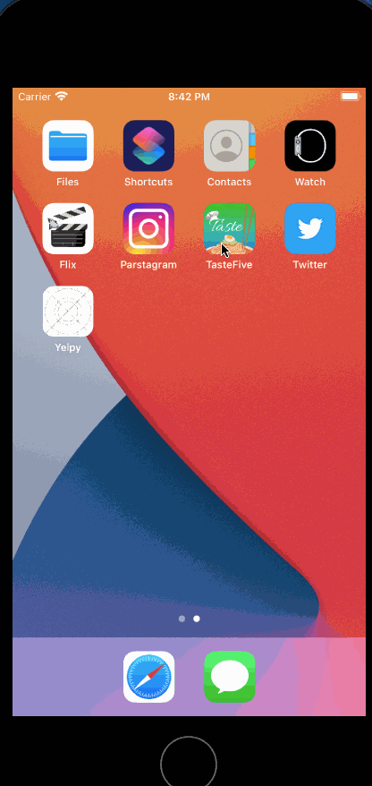
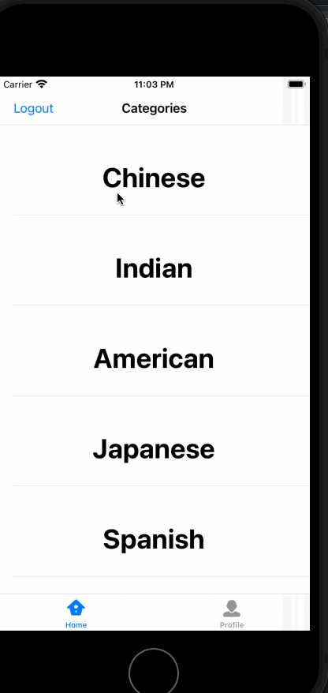
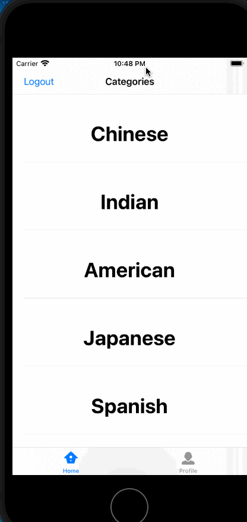
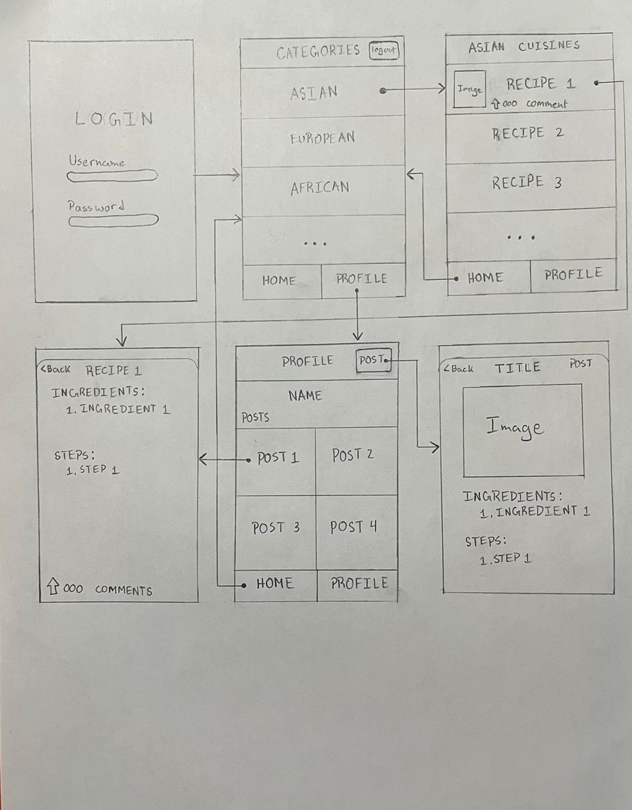

# TasteFive
Original App Design Project - README Template
===

# TasteFive

## Table of Contents
1. [Overview](#Overview)
1. [Product Spec](#Product-Spec)
1. [Wireframes](#Wireframes)
2. [Schema](#Schema)

## Overview
### Description
An app that lets users upload recipes and categorize them. Other users can view the recipes and rate/like and comment.

### App Evaluation
[Evaluation of your app across the following attributes]
- **Category:** Food/Social
- **Mobile:** Mobile only
- **Story:** An app that lets users upload recipes and categorize them. Other users can view the recipes and rate/like and comment.
- **Market:** Culinary Enthusaists that want to try out new recipes
- **Habit:** Users can use this app whenever they want to share their latest culinary creation, or gather inspiration from other users.
- **Scope:** Starts out with users able to view and share recipies. Later on, users will be able to like/rate and comment on other users' recipes. Furthermore, ingredients could have a listed price, so users can see the approximate cost of the recipe.

## Product Spec

### 1. User Stories (Required and Optional)

**Required Must-have Stories**

- [x] User can login
- [x] User can Register
- [x] User can choose what cuisine/category to view
- [x] User can Upload Recipes
- [x] User can view recipes

**Optional Nice-to-have Stories**
- [x] User Profile Section
- [ ] User Upvote Recipes
- [ ] User can comment on Recipes
- [ ] User can share Recipes
- [ ] User can reshare Recipes

## Video Walkthrough

Here's a walkthrough of implemented user stories for Sprint 1:



Here's a walkthrough of implemented user stories for Sprint 2:



Here's a walkthrough of edits for Sprint 3:

 

### 2. Screen Archetypes

* Login screen
    * User can login
    * User can Register
* Category Screen
   * User can choose what cuisine/category to view
* Category Feed
    * User can view recipes from the category chosen
* Profile Screen
    * User can view previous posts and create a new recipe post.

    

### 3. Navigation

**Tab Navigation** (Tab to Screen)

* Home
* Profile

**Flow Navigation** (Screen to Screen)

* Login/Register Screen
   * Categories Screen
* Categories Screen
   * Category Feed
* Profile
    * Create Recipe Post
        * Present Modally creating post
    * See previously uploaded user Recipe Posts
        * Detailed View

## Wireframes
[Add picture of your hand sketched wireframes in this section]


### [BONUS] Digital Wireframes & Mockups

### [BONUS] Interactive Prototype

## Schema 
[This section will be completed in Unit 9]

### Models
Post
| Property | Type    | Description |
| -------- | -------- | -------- |
| objectId | String    | unique id for the user post (default field)     |
| author | Pointer to User    | image author     |
| image | File    | image that user posts     |
| category | String    | category of recipe   |
| caption | String    | image caption by author    |
| commentsCount | Number    | number of comments that has been posted to an image     |
| likesCount | Number | number of likes for the post     |
| createdAt | DateTime | date when post is created (default field)     |

User
| Property | Type    | Description |
| -------- | -------- | -------- |
| username | String |Username of PFUser|
| objectId | String    | unique id for the user post (default field)     |
| password | String | password associated with a user |
| createdAt | DateTime | date when post is created (default field)     |

Comments
| Property | Type    | Description |
| -------- | -------- | -------- |
| objectId | String    | unique id for the user post (default field)     |
| author | Pointer to User    | image author| 
|createdAt | DateTime | date when post is created (default field) |
| text | String | the comment text |
| post | Pointer to Post | post author |


[Add table of models]
### Networking
- Login/Signup Screen
    - (Read/GET) Query user and Passwords
    - (Create/POST) Create new user with password
- Categories Feed Screen
    - (Read/GET) Query all posts where category is tagged
    - (Read/GET) Query all likes for the posts
- Recipe Detail View Screen
    - (Read/GET) Query all likes for the posts
    - (Read/GET) Query all comments for the posts
    - (Create/POST) Create a new like on post
    - (Delete) Delete existing like
    - (Create/POST) Create new comment on post
    - (Delete) Delete exisitng comment

- Profile Screen
    - (Read/GET) Get all posts of the user 
```
let query = PFQuery(className:"Post")
query.whereKey("author", equalTo: currentUser)
query.order(byDescending: "createdAt")
query.findObjectsInBackground { (posts: [PFObject]?, error: Error?) in
   if let error = error { 
      print(error.localizedDescription)
   } else if let posts = posts {
      print("Successfully retrieved \(posts.count) posts.")
  // TODO: Do something with posts...
   }
}

```
- (Read/GET) Get the username of the user 

- Create Recipe Post Screen
    - (Create/POST) Create an image for the post
    - (Create/POST) Create list of ingredients and steps for the post
    - (Create/POST) Create the tagged category
- [Add list of network requests by screen ]
- [Create basic snippets for each Parse network request]
- [OPTIONAL: List endpoints if using existing API such as Yelp]
